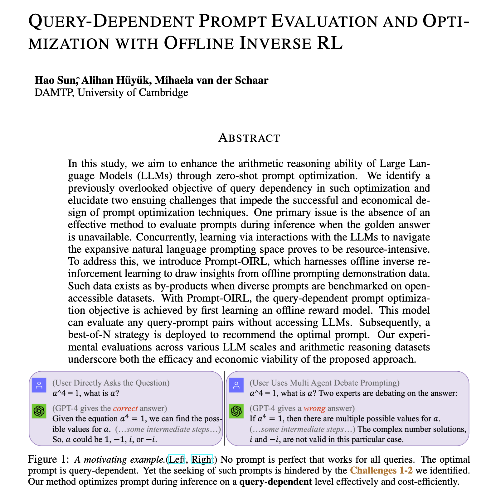

# Prompt-OIRL
code for paper Query-Dependent Prompt Evaluation and Optimization with Offline Inverse Reinforcement Learning
https://arxiv.org/pdf/2309.06553.pdf 

#### Prompt-OIRL has been selected as an oral presentation at the ENLSP workshop at NeurIPS'2023. We look forward seeing you at NeurIPS!

### Code and Offline Data
- Code and Offline Data for experiments using LLaMA2-7B is now released!

You need to 

1. get license to use LLaMA-2 from https://ai.meta.com/llama/

2. get access to the SVAMP dataset: https://github.com/arkilpatel/SVAMP

3. get access to the GSM8K dataset: https://huggingface.co/datasets/gsm8k

3. run the code: from step 1 - step 5 to generate-, reorganize-, process- data, and then perform reward modeling (offline evaluation) and optimization.


### A related Blog:
This blog introduces the perspective of RL in LLM research:
[A Crash Introduction to RL in the Era of LLMs: What is Essential, RLHF, Prompting, and Beyond.](https://holaris.notion.site/A-Crash-Introduction-to-RL-in-the-Era-of-LLMs-What-is-Essential-RLHF-Prompting-and-Beyond-cbe9af5aa722488b9aade4de6ab9c565?pvs=4)

### Preview



### Abstract 

> In this study, we aim to enhance the arithmetic reasoning ability of Large Language Models (LLMs) through zero-shot prompt optimization. We identify a previously overlooked objective of query dependency in such optimization and elucidate two ensuing challenges that impede the successful and economical design of prompt optimization techniques. One primary issue is the absence of an effective method to evaluate prompts during inference when the golden answer is unavailable. Concurrently, learning via interactions with the LLMs to navigate the expansive natural language prompting space proves to be resource-intensive.

> To address this, we introduce Prompt-OIRL, which harnesses offline inverse reinforcement learning to draw insights from offline prompting demonstration data. Such data exists as by-products when diverse prompts are benchmarked on open-accessible datasets. With Prompt-OIRL, the query-dependent prompt optimization objective is achieved by first learning an offline reward model. This model can evaluate any query-prompt pairs without accessing LLMs. Subsequently, a best-of-N strategy is deployed to recommend the optimal prompt. Our experimental evaluations across various LLM scales and arithmetic reasoning datasets underscore both the efficacy and economic viability of the proposed approach.

### Cite Our Paper or Code

```
@article{sun2023offline,
  title={Offline Prompt Evaluation and Optimization with Inverse Reinforcement Learning},
  author={Sun, Hao},
  journal={arXiv preprint arXiv:2309.06553},
  year={2023}
}
