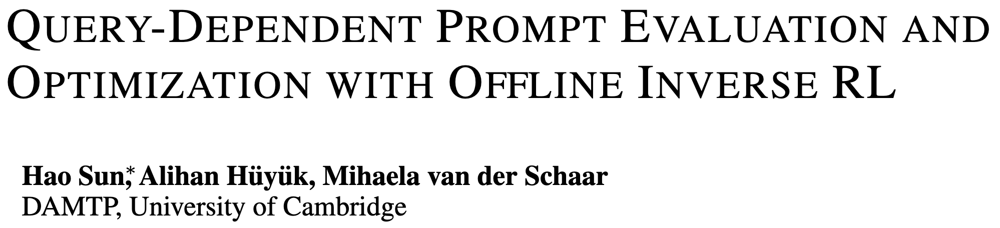
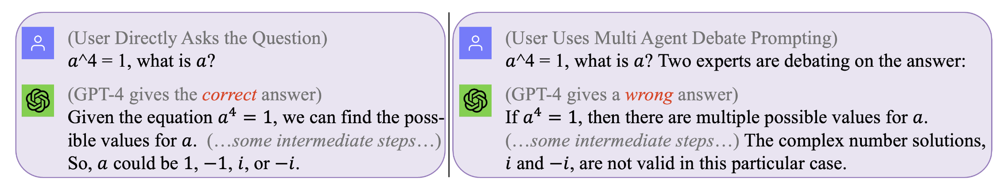

# 🪄 Prompt-OIRL: Learning to Prompt LLMs with Expert Knowledge (Known Magic Words 🧙)

### 💻 Implementation and 📒 tutorial for ICLR 2024 paper

 

- [Paper Link](https://arxiv.org/pdf/2309.06553.pdf)
- [Open Review Link](https://openreview.net/forum?id=N6o0ZtPzTg)


## 🔥 News
- (2024.2) (Internal Code-Reviewing) Code with GPT3.5 and TigerBot to be released.
- (2024.1) Prompt-OIRL has been accepted by ICLR'2024. We look forward to talking with you in Vienna!
- (2024.12) Prompt-OIRL has been presented at the NeurIPS conference. Thanks for all the invaluable feedback!
- (2023.10) Code with LLaMA2 has been released.
- (2023.10) Prompt-OIRL has been featured in a positioning [paper](https://arxiv.org/pdf/2310.06147.pdf) as an example of **inverse alignment**.
- (2023.9) Prompt-OIRL has been selected as an **oral presentation** at the ENLSP workshop at NeurIPS'2023.

## 📖 Abstract

> In this study, we aim to enhance the arithmetic reasoning ability of Large Language Models (LLMs) through zero-shot prompt optimization. We identify a previously overlooked objective of query dependency in such optimization and elucidate two ensuing challenges that impede the successful and economical design of prompt optimization techniques. One primary issue is the absence of an effective method to evaluate prompts during inference when the golden answer is unavailable. Concurrently, learning via interactions with the LLMs to navigate the expansive natural language prompting space proves to be resource-intensive.
To address this, we introduce Prompt-OIRL, which harnesses offline inverse reinforcement learning to draw insights from offline prompting demonstration data. Such data exists as by-products when diverse prompts are benchmarked on open-accessible datasets. With Prompt-OIRL, the query-dependent prompt optimization objective is achieved by first learning an offline reward model. This model can evaluate any query-prompt pairs without accessing LLMs. Subsequently, a best-of-N strategy is deployed to recommend the optimal prompt. Our experimental evaluations across various LLM scales and arithmetic reasoning datasets underscore both the efficacy and economic viability of the proposed approach.

## 🤔 Motivating Example


Figure 1. **No prompt is perfect that works for all queries**. The optimal prompt is query-dependent. Yet the seeking of such prompts can be costly and inefficient.
    Prompt-OIRL optimizes prompt during inference time on a **query-dependent** level effectively and cost-efficiently.
(original chat logs with GPT4 for those motivating examples can be found at [Left](https://chat.openai.com/share/0f2d11b1-322a-4c47-a877-ad6fbace8179), [Right](https://chat.openai.com/share/15870a47-93c7-4b98-96c8-af0516c0c999))

## ⚙️ Reproduction

### Preliminaries

To reproduce our results (e.g., using LLaMA2)

1. get the [license to use LLaMA-2](https://ai.meta.com/llama/).

2. get access to the datasets: [SVAMP](https://github.com/arkilpatel/SVAMP), [GSM8K](https://huggingface.co/datasets/gsm8k), [MAWPS](https://github.com/sroy9/mawps)

### Create a Virtual Env
1. Clone the repository
```
git clone git@github.com:holarissun/Prompt-OIRL.git
```
2. Create a new virtual environment with Python 3.10, e.g.,
```
conda create --name prompt-oirl python==3.10
conda activate prompt-oirl
cd Prompt-OIRL
```
3. Install the requirements
```
pip install -r requirements.txt
```

### Reproduce the Main Results
 #### Step 1. (Optional, as we also released the offline dataset) Generate an offline dataset by interacting with the LLMs.
 This step will take a long time --- typically a few days. To avoid repeating such a computationally expensive (when running LLMs on local machines) or costly (when calling the commercial APIs like GPT3.5 or TigerBot) process, we have **released all the interactive logs with those LLMs collected in our experiments.**. Therefore, if you are just looking to explore the method and don't need to re-create everything from scratch, we recommend that you skip this step,

 If you would like to reproduce the offline dataset with the llama2 model, you need to follow these steps:

 ```
 git clone git@github.com:facebookresearch/llama.git
 ```
and then move
```Prompt-OIRL/llama_exps/llama_step1_gen_offline.py```
to the ```llama``` folder

then run the following command

 ```
torchrun --nproc_per_node 1 llama_step1_gen_offline.py \
    --ckpt_dir llama-2-7b-chat/ \
    --tokenizer_path tokenizer.model \
    --max_seq_len 512 --max_batch_size 8 --prompt_idx 0 --dataset_eval gsm8k
 ```
 #### Step 2. Reorganize the collected offline data
 For the easiest way to run the experiment it is recommended that you start with this step.  This step will take a few seconds to finish, it will do some file renaming and training-test split and save corresponding files to a new folder ```LMllama2```

 ```
 python3 llama_step2_reorg_data.py
 ```

 #### Step 3. Pre-process the offline data
 This step will take a few seconds to finish, it will process the data and store embeddings and labels for different experiment settings (i.e., with different availability of training prompts) with ```.npy``` format files.

 Note: please make sure that you select the relevant task by updating the code (the line marked with `NOTE`) in this and the following 2 steps.
 ```
 python3 llama_step3_data_processing.py
 ```
 #### Step 4. Proxy Reward Model Learning (i.e., Offline Prompt Evaluation)
 This step will take a few minutes to a few hours to finish, depending on the algorithms chosen and the processor. In general, training an XGBoost reward model will take a bit longer time, and using a LightGBM reward model can be faster.
 ```
 python3 llama_step4_offline_evaluation.py
 ```
- Note: you will need to download a missing embedding file from [this link](https://drive.google.com/file/d/1ER50FoLInO1pTr50dDjjZMBGPX-pXVA1/view?usp=sharing) and place it in the `embeddings` directory to run this step. (oversized for Github, ~ 230Mb)

 #### Step 5. (Offline) Prompt Optimization
 This step will take a few minutes to finish. Evaluating the algorithms by interacting with the LLMs can also be an option but could be slower. Results under different settings will be all saved to ```.csv``` files
 ```
 python3 llama_step5_offline_optimization.py
 ```


## 🚀 A Related Discussion on RLHF:
Prompt-OIRL addresses the prompting problems in LLMs using an RLAIF approach. For readers who are also interested in RLHF and RLAIF, and in the intersection between RL and LLM research, we would refer to our related positioning paper discussing RL in LLM research:
[RL in the Era of LLMs: What is Essential? What is Needed? RLHF, Prompting, and Beyond.](https://arxiv.org/pdf/2310.06147.pdf)


## 📚 BibTex Citation
If you would like to cite our code or paper, please use

```
@inproceedings{sun2023query,
  title={Query-Dependent Prompt Evaluation and Optimization with Offline Inverse RL},
  author={Sun, Hao and H{\"u}y{\"u}k, Alihan and van der Schaar, Mihaela},
  booktitle={The Twelfth International Conference on Learning Representations},
  year={2024}
}


@article{sun2023reinforcement,
  title={Reinforcement Learning in the Era of LLMs: What is Essential? What is needed? An RL Perspective on RLHF, Prompting, and Beyond},
  author={Sun, Hao},
  journal={arXiv preprint arXiv:2310.06147},
  year={2023}
}
